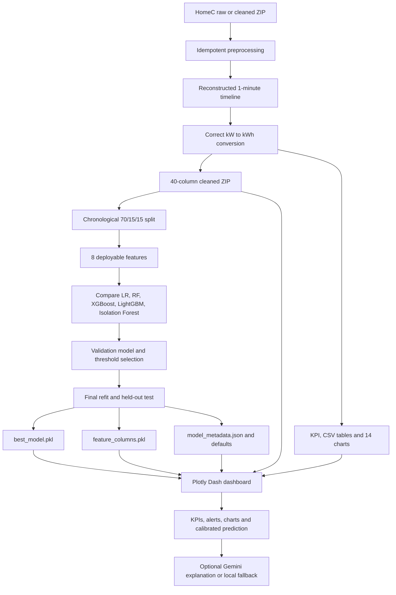

```mermaid
flowchart TD
    A[HomeC raw or cleaned ZIP] --> B[Idempotent preprocessing]
    B --> C[Reconstructed 1-minute timeline]
    C --> D[Correct kW to kWh conversion]
    D --> E[40-column cleaned ZIP]
    D --> F[KPI, CSV tables and 14 charts]

    E --> G[Chronological 70/15/15 split]
    G --> H[8 deployable features]
    H --> I[Compare LR, RF, XGBoost, LightGBM, Isolation Forest]
    I --> J[Validation model and threshold selection]
    J --> K[Final refit and held-out test]
    K --> L[best_model.pkl]
    K --> M[feature_columns.pkl]
    K --> N[model_metadata.json and defaults]

    E --> O[Plotly Dash dashboard]
    F --> O
    L --> O
    M --> O
    N --> O
    O --> P[KPIs, alerts, charts and calibrated prediction]
    P --> Q[Optional Gemini explanation or local fallback]
```
